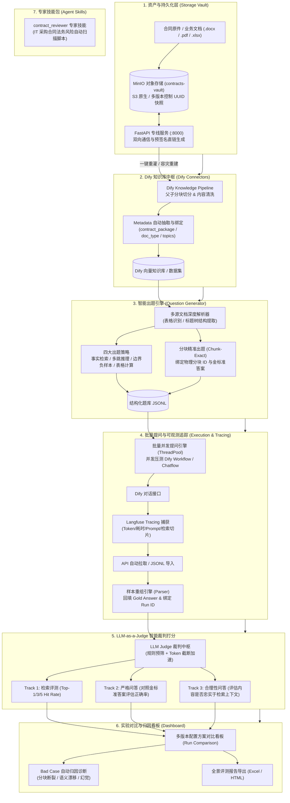

# 🚀 Langfuse RAG Studio · 知识库资产归档与全链路智能评测平台

> **"让 RAG 性能调优告别玄学，用确定性的数据基准与链路追踪驱动知识库演进。"**  
> 面向企业级 RAG 知识库与合同审核场景的全流程自动化开发、评测与资产归档系统。实现从 **合同资产归档 ➔ Dify 知识库多版本入库 ➔ 物理切块智能精准出题 ➔ Dify 并发提问 ➔ Langfuse Tracing 样本解析 ➔ LLM-as-a-Judge 三轨裁判打分 ➔ 实验对比看板与 Bad Case 归因诊断** 的工业级自动化闭环。

<p align="center">
  
  
  
  
  
  
  
  
</p>

---

## 💡 为什么构建本项目？（核心痛点与闭环架构）

在企业真实场景（如法务 IT 采购合同审核、制度问答等）中推进 RAG 落地时，研发与业务通常面临以下**四大痛点**：

1. **RAG 效果评估纯凭主观感觉，缺乏客观 Benchmark**：切片分段（Chunk Size）设 500 还是 1000？父子分块效果提升了多少？往往缺乏量化测试集与自动化裁判打分体系；
2. **手工测试与数据翻查极其痛苦**：手动在 Dify 里逐题问答，手动在 Langfuse 控制台翻找单条 Trace JSON，耗时且无法形成批量横向对比；
3. **知识库原件资产与向量库状态脱节**：合同原件丢失版本回溯能力，当知识库切片重置或重构时，无法一键灾备重灌；
4. **Bad Case 无法高效归因定位**：召回失败究竟是因为**“文本切片被切断了”**、**“关键词未匹配”**，还是**“大模型推理幻觉”**？缺乏自动化归因诊断看板。

本项目通过 **7 大核心模块 + 1 个企业级专家技能包**，彻底打通这一整套闭环体系。

---

## 🏛️ 系统架构与全链路数据流



---

## 🖥️ 七大功能大屏业务流程详解

启动 Streamlit 后，系统左侧导航栏提供 7 个功能工作台，按标准研发评测工序从上往下执行：

### 1. 📑 材料入库 (Ingestion & MinIO Vault)
- **MinIO 资产归档**：上传合同原件，系统自动归档至 MinIO `contracts-vault` 存储桶，支持**多版本控制（Versioning）**，同名文件更新自动生成历史 UUID 快照；
- **Dify Knowledge Pipeline 自动打通**：通过 FastAPI 专线直通 Dify Docker 容器，自动执行正文提取与父子分块切分；
- **Metadata 智能抽取**：自动调用大模型为文档打上 `contract_package`、`document_type`、`document_title`、`topics` 等结构化元标签；
- **一键容灾回滚**：当知识库被误清空或需要测试历史版本时，支持从 MinIO 历史快照**一键提取原件并重新灌入 Dify**。

### 2. 🔍 知识库探索 (KB Explorer)
- 直连 Dify 数据集，实时浏览文档分块数量、分段正文字符、元数据键值；
- 支持在线执行**文本全文检索与向量相似度检索测试**，实时观察分块召回效果。

### 3. ✍️ 题目生成 (Question Generator)
- **多格式解析**：深度结构化支持 `.docx`、`.pdf`、`.xlsx`、`.txt`、`.md`；
- **分块精准出题（Chunk-Exact）**：直接依据实际物理切块出题，将标准答案与原文档证据位置强行锚定，打造**零歧义的金标准评测基准题（Gold QA Dataset）**；
- **复杂表格出题（Spreadsheet QGen）**：自动提取 Excel 表头角色，生成数值运算与报价比对等高难度问题。

### 4. 🚀 批量提问 (Batch Query)
- 多线程并发向 Dify Chatflow / Workflow API 发起批量测试提问；
- 完整截获 Prompt、实际召回的 Chunks、模型生成的回答、Token 消耗及响应耗时；
- 每次测试自动创建唯一的 **`run_id`（配置方案快照）**，支持切分策略版本追溯。

### 5. 📦 样本准备 (Sample Preparation)
- **支持双通道数据导入**：
  1. 直接调用 Langfuse API 远程拉取 Trace；
  2. 从本地选择 Langfuse 导出的原始 `JSONL` 文件。
- **数据扁平化重组**：将复杂的 Event 级层级嵌套日志，按 `trace_id` 重组为扁平化的“单次问答样本”；
- **参考答案回填**：自动将题库中的 `reference_answer` 按问题对齐回填到评测样本中。

### 6. ⚖️ Judge 评测 (LLM-as-a-Judge)
- 支持接入 OpenAI / DeepSeek / 通义千问 / 本地 Ollama 作为裁判模型；
- **三轨道独立评分体系**：
  - 🎯 **`retrieval`（检索质量）**：评估召回切片中是否命中标准答案证据（Top-1 / Top-3 / Top-5 命中率）；
  - 📏 **`strict_qa`（严格问答）**：对比参考答案，严格打分正确性、完整性与幻觉程度；
  - 🛡️ **`grounded_qa`（合理性问答）**：评估大模型回答是否完全基于检索到的证据，是否存在凭空捏造。
- **降本加速机制**：内置规则预筛选、内容哈希去重与超长文本截断，大幅降低打分 Token 消耗。

### 7. 📊 运行看板与调优分析 (Dashboard & Bad Case Diagnostic)
- **多方案对比分析**：直观对比方案 A（如 500 字分块）与方案 B（如父子分块）在 Top-K 命中率和回答准确率上的具体差异；
- **Bad Case 自动化归因诊断**：
  - 自动识别并归类失败原因（切片截断 / 检索漂移 / 模型幻觉 / 答案不完整）；
  - 输出具体、可落地的知识库切分调优建议；
- **多格式全景导出**：支持一键导出包含数据汇总图表与逐题明细的 **Excel 与 HTML 格式评测综合报告**。

---

## 🧰 专家技能包 (Agent Skills)

除了评测主工程外，仓库在 [`skills/`](skills/) 目录下提供了面向真实业务落地的高阶 Agent 能力包：

### 📄 `skills/contract_reviewer/`（合同智能审查技能）
- **定位**：IT 采购合同法务合规专家技能包；
- **核心能力**：
  - 内置 [`scripts/review_contract.py`](skills/contract_reviewer/scripts/review_contract.py)，自动解析 Word 合同文档并执行条款规则库比对；
  - 产出 **5 段式法务决策报告**：决策驾驶舱、权责变动全景图（Mermaid 流程图）、核心条款风险明细表与法务谈判应对策略。

---

## 📂 项目工程结构与数据流转

```text
Langfuse_test/
├── app.py                      # 🖥️ Streamlit 7 大业务大屏主入口 (10,000+ 行高集成看板)
├── main.py                     # 💻 CLI 命令行批处理工具入口
├── pytest.ini                  # 🧪 测试配置 (pythonpath = .)
├── requirements.txt            # 📦 生产依赖清单
├── 需求文档.md                  # 📑 原始业务需求与技术架构规范
│
├── storage/                    # 🗄️ 1. 资产与持久化层
│   ├── minio_vault.py          # MinIO S3 SDK 封装、UUID 版本控制、预签名加密直链
│   └── vault_server.py         # FastAPI 专线通信服务 (端口 8000，供 Dify 容器调用)
│
├── connectors/                 # 🤖 2. 外部系统连接中枢
│   ├── dify_connection.py      # Dify API 凭据鉴权管理
│   ├── dify_kb_connection.py   # Dify 知识库配置管理
│   ├── dify_knowledge.py       # Dify 知识库文档/分段探索
│   ├── dify_ingestion.py       # Dify Pipeline 批量入库与元数据抽取
│   ├── langfuse_connection.py  # Langfuse 认证管理
│   ├── langfuse_project.py     # Langfuse 项目与数据集管理
│   └── fetch_traces.py         # Langfuse API Trace 远程抓取
│
├── generator/                  # ✍️ 3. 智能出题与文档解析
│   ├── question.py             # 题目数据结构 Schema
│   ├── question_generator.py   # LLM 核心出题引擎
│   ├── chunk_exact_questions.py # 分块精准锚定出题
│   ├── spreadsheet_question_generator.py # 表格精准出题引擎
│   ├── xlsx_question_generator.py # XLSX 兼容包装层
│   ├── doc_parser.py           # Word/PDF/Excel 文档提取与清洗
│   └── parser.py               # 基础切片辅助工具
│
├── evaluation/                 # ⚖️ 4. 评测裁判与实验分析
│   ├── batch_query.py          # 并发批量提问引擎
│   ├── judge.py                # LLM-as-a-Judge 裁判打分引擎
│   ├── experiment.py           # 评测实验、配置方案与历史看板
│   ├── optimization_analysis.py # Bad Case 归因诊断与调优建议生成
│   ├── retrieval_diff.py       # 检索 Diff 对比分析
│   └── report_export.py        # 综合评测报告导出 (Excel/HTML)
│
├── skills/                     # 🎯 5. 专家技能扩展库
│   └── contract_reviewer/      # 合同智能比对与风险评估专家技能
│       ├── SKILL.md            # 技能 SOP 规约
│       └── scripts/            # 独立可执行评估脚本
│
├── prompts/                    # 📝 裁判与出题 Prompt 模板库
├── data/                       # 💾 本地持久化数据目录
│   ├── raw/                    # 原始导出的 Langfuse JSONL
│   ├── processed/              # 解析清洗后的结构化样本
│   ├── judged/                 # 裁判打分结果记录
│   ├── questions/              # 生成的题集 JSONL
│   ├── batch/                  # 批量提问完整响应
│   ├── config_profiles/        # 配置方案快照
│   └── experiments/            # 历史实验运行记录
└── tests/                      # 🧪 50+ 单元测试覆盖套件
```

---

## 🛠️ 快速上手与环境部署

### 1. 环境准备 (Python 3.11+)

```bash
# 克隆仓库
git clone https://github.com/NightMare33133/Langfuse_test.git
cd Langfuse_test

# 创建并激活虚拟环境
python3 -m venv .venv
source .venv/bin/activate  # macOS / Linux
# .venv\Scriptsctivate   # Windows

# 安装依赖
pip install -r requirements.txt
```

### 2. 环境变量配置 (`.env`)

复制示例配置文件并根据你的环境修改：
```bash
cp .env.example .env
```

核心配置项说明：

```dotenv
# --- MinIO S3 资产保险库配置 ---
MINIO_ENDPOINT="localhost:9005"
MINIO_ACCESS_KEY="admin"
MINIO_SECRET_KEY="password123"
MINIO_CONTRACTS_BUCKET="contracts-vault"
MINIO_SECURE=false

# --- LLM 裁判与出题模型配置 (兼容 OpenAI / DeepSeek / 通义千问等) ---
JUDGE_API_KEY="your-llm-api-key"
JUDGE_API_BASE="https://api.deepseek.com/v1" # 或 https://dashscope.aliyuncs.com/compatible-mode/v1
JUDGE_MODEL="deepseek-chat"

# --- Dify 平台配置 ---
DIFY_API_BASE="http://localhost/v1"
DIFY_API_KEY="app-xxxxxxxxxxxxxxxx"

# --- Langfuse 可观测性平台配置 ---
LANGFUSE_PUBLIC_KEY="pk-lf-..."
LANGFUSE_SECRET_KEY="sk-lf-..."
LANGFUSE_HOST="http://localhost:3000" # 或云端服务 https://cloud.langfuse.com
```

### 3. 一键启动 Streamlit 工作台

```bash
streamlit run app.py
```

终端将输出访问地址，打开浏览器访问 **`http://localhost:8501`** 即可进入主看板。  
*(注：系统后台会自动拉起运行在 `8000` 端口的 FastAPI 资产专线服务)*。

---

## 🌐 端口与微服务依赖矩阵

| 服务组件 | 协议 / 端口 | 作用与交互场景 |
| :--- | :--- | :--- |
| **Streamlit 大屏** | `HTTP / 8501` | 本地核心用户操作台、实验看板与报告下载 |
| **FastAPI 专线** | `HTTP / 8000` | 专为 Dify 容器提供合同原件下载与存储回调的专线接口 |
| **Dify 控制台** | `HTTP / 80` | 知识库管理、父子切分与 Workflow 编排端 |
| **MinIO API** | `S3 / 9005` | S3 原生数据读写端口，负责合同原件与多版本快照存储 |
| **MinIO Web Console** | `HTTP / 9001` | MinIO 可视化管理面板，支持图形化查验 Bucket 与快照 |
| **Langfuse 控制台** | `HTTP / 3000` | 大模型可观测性看板，用于排查底层 Trace 详细耗时与 Span |

---

## 🧪 自动化测试验证

项目内置了完备的自动化测试体系（包含存取、解析、出题、提问、打分等各个子模块）：

```bash
# 执行全部单元测试
pytest

# 仅测试存储与 MinIO 逻辑
pytest tests/test_minio_vault.py

# 仅测试裁判打分逻辑
pytest tests/test_judge.py
```

---

## 📄 开源许可证
本项目基于 [MIT License](LICENSE) 开源。
