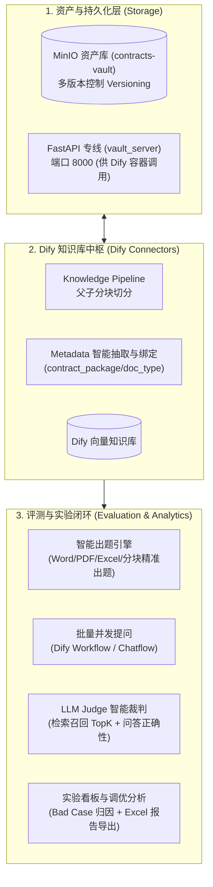

# RAG 知识库与智能评测平台

面向 RAG 知识库的全链路自动化开发与评测系统。涵盖 **合同批量入库、MinIO 对象资产归档与多版本管理、知识库探索、智能题目生成、Dify 批量提问、LLM-as-a-Judge 裁判打分、实验对比看板与 Bad Case 调优分析**。

---

## 🌟 核心能力架构



---

## 🚀 七大核心业务功能

### 1. 📑 批量知识库入库（Batch Ingestion）
- **自动流水线入库**：调用 Dify Knowledge Pipeline，自动完成文档正文提取、父子分块切分与向量索引构建；
- **Metadata 自动化生命周期**：自动调用大模型抽取 `contract_package`、`document_type`、`document_title`、`topics` 等结构化元数据；
- **字段检测与一键自愈**：自动核对目标知识库 Schema，若缺少必填字段支持一键初始化；
- **文件防重与状态追踪**：基于内容哈希去重，防止重复切分索引。

### 2. 🗄️ MinIO 合同资产保险库（Contract Vault）
- **S3 原生对象存储**：将合同原件自动归档至 `contracts-vault` 存储桶；
- **多版本控制（Versioning）**：同名合同再次上传自动生成唯一 UUID 版本快照，防覆盖、可回溯；
- **安全预签名直链**：自动生成 AWS S3 加密签名的 1 小时安全预览/下载直链；
- **FastAPI 专线桥梁**：运行在 `8000` 端口，为 Dify Docker 容器提供高可用归档接口；
- **一键容灾重建索引（Re-indexing）**：支持直接从 MinIO 调取历史版本原件，一键批量重灌进 Dify 知识库。

### 3. 🔍 知识库数据探索（KB Explorer）
- 直连 Dify 知识库，实时浏览数据集下包含的文档清单、切片数量、分段明细；
- 支持段落全文搜索与相似度向量检索测试。

### 4. ✍️ 智能评测题库生成（Question Generator）
- **多格式智能解析**：支持 `.docx`、`.pdf`、`.xlsx`、`.txt`、`.md` 深度结构化提取；
- **四大出题策略**：事实检索题、多跳逻辑推理题、边界负样本题、全流程问答题；
- **分块精准出题（Chunk-Exact）**：基于物理切块目录，生成带有金标准证据位置的绝对基准题；
- **复杂表格出题（Spreadsheet QGen）**：自动分析 Excel Schema 角色，支持数值计算题与价格锚点验证。

### 5. 🚀 并发批量提问（Batch Query）
- 多线程并发向 Dify Chatflow / Workflow API 发起批量测试提问；
- 完整记录 Prompt、检索到的 Chunks、模型回答、Token 消耗与耗时；
- 每次测试自动绑定 **RAG 配置方案快照（Run ID）**，支持多版本切分参数追溯。

### 6. ⚖️ LLM-as-a-Judge 裁判打分（Automated Evaluation）
- **三轨道评分体系**：
  - `retrieval`（检索评测）：Top-1 / Top-3 / Top-5 命中率判定；
  - `strict_qa`（严格问答）：对比参考答案打分（准确率、幻觉率、完整度）；
  - `grounded_qa`（合理性问答）：评估回答是否完全忠实于检索到的切片上下文。
- **评测加速优化**：内置规则预筛选、内容级去重与 Token 截断，大幅降低打分成本。

### 7. 📊 实验对比与运行看板（Dashboard & Reporting）
- **多版本实验对比**：对比 V1（基线切分）与 V2（优化后切分）的命中率提升幅度；
- **Bad Case 归因诊断**：自动归类未召回原因（分块过大/断句截断/语义偏离/模型误答）并生成具体调优建议；
- **一键导出全景报告**：支持导出包含图表、指标汇总和逐题明细的 Excel 与 HTML 评测报告。

---

## 📂 项目工程架构

项目按照标准模块化设计，业务逻辑划分为 4 个清晰子包：

```text
Langfuse_test/
├── app.py                      # 🖥️ Streamlit 交互大屏主入口
├── main.py                     # CLI 命令行工具
├── pytest.ini                  # 🧪 测试配置文件 (pythonpath = .)
│
├── storage/                    # 🗄️ 1. 资产与存储子包
│   ├── __init__.py
│   ├── minio_vault.py          # MinIO S3 SDK 封装、版本控制、预签名
│   └── vault_server.py         # FastAPI 归档通信服务 (端口 8000)
│
├── connectors/                 # 🤖 2. 外部系统连接器子包
│   ├── __init__.py
│   ├── dify_connection.py      # Dify API 凭据管理
│   ├── dify_kb_connection.py   # Dify 知识库配置管理
│   ├── dify_knowledge.py       # Dify 知识库文档/分段探索
│   ├── dify_ingestion.py       # Dify Pipeline 批量入库与元数据绑定
│   ├── langfuse_connection.py  # Langfuse 认证管理
│   ├── langfuse_project.py     # Langfuse 项目与数据集管理
│   └── fetch_traces.py         # Langfuse 追踪数据抓取
│
├── generator/                  # ✍️ 3. 智能出题与文档解析子包
│   ├── __init__.py
│   ├── question.py             # 题目数据结构 Schema
│   ├── question_generator.py   # LLM 核心出题引擎
│   ├── chunk_exact_questions.py # 分块精准出题引擎
│   ├── spreadsheet_question_generator.py # 表格精准出题引擎
│   ├── xlsx_question_generator.py # XLSX 兼容包装层
│   ├── doc_parser.py           # Word/PDF/Excel 文档解析与清洗
│   └── parser.py               # 基础分块辅助工具
│
├── evaluation/                 # ⚖️ 4. 评测裁判与实验分析子包
│   ├── __init__.py
│   ├── batch_query.py          # 并发批量提问引擎
│   ├── judge.py                # LLM-as-a-Judge 裁判打分引擎
│   ├── experiment.py           # 评测实验与对比看板
│   ├── optimization_analysis.py # Bad Case 归因与建议生成
│   ├── retrieval_diff.py       # 检索 Diff 对比分析
│   └── report_export.py        # 综合评测报告导出 (Excel/HTML)
│
├── prompts/                    # 📝 出题与 Judge Prompt 模板库
├── data/                       # 💾 本地数据与缓存目录
└── tests/                      # 🧪 单元测试集 (1250+ 测试全量覆盖)
```

---

## 🛠️ 环境依赖与快速启动

### 1. 安装环境依赖

```bash
# Python 3.11+
python -m venv .venv
source .venv/bin/activate
pip install -r requirements.txt
# 或直接安装核心依赖:
pip install streamlit fastapi uvicorn minio pandas plotly requests python-dotenv openpyxl python-docx
```

### 2. 环境变量配置 (`.env`)

复制 `.env.example` 并填入必要信息：
```bash
cp .env.example .env
```

| 配置项 | 默认值 | 说明 |
| :--- | :--- | :--- |
| `MINIO_ENDPOINT` | `localhost:9005` | 合同资产库 MinIO S3 端口 |
| `MINIO_ACCESS_KEY` | `admin` | MinIO 账号 |
| `MINIO_SECRET_KEY` | `password123` | MinIO 密码 |
| `MINIO_CONTRACTS_BUCKET` | `contracts-vault` | 存储桶名称 |
| `JUDGE_API_KEY` | - | 裁判大模型 API Key |
| `JUDGE_API_BASE` | `https://token-plan-cn.xiaomimimo.com/v1` | 大模型 API Base URL |
| `JUDGE_MODEL` | `mimo-v2.5-pro` | 裁判与出题模型名称 |
| `LANGFUSE_HOST` | `http://localhost:3000` | Langfuse 服务地址 |

### 3. 一键启动看板

```bash
streamlit run app.py
```
启动后在浏览器访问 `http://localhost:8501`。
*(后台将自动常驻拉起 8000 端口的 FastAPI 归档专线服务)*。

---

## 🌐 端口与服务矩阵

| 服务名称 | 访问地址 | 作用说明 |
| :--- | :--- | :--- |
| **Streamlit 大屏** | `http://localhost:8501` | 前端用户操作与评测看板 |
| **FastAPI 专线** | `http://localhost:8000` | 供 Dify 工作流调用的 MinIO 归档接口 |
| **Dify Web 控制台** | `http://localhost:80` | Dify 知识库与工作流编排端 |
| **MinIO Web 控制台** | `http://localhost:9001` | MinIO 对象存储可视化管理面板 |
| **MinIO S3 API** | `http://localhost:9005` | S3 协议数据读写端口 |
| **Langfuse 控制台** | `http://localhost:3000` | 大模型 Observability 与 Tracing |

---

## 🧪 自动化测试验证

项目内置了完整的单元测试套件，执行命令：

```bash
pytest
```
- 覆盖存储、解析、出题、提问、打分与看板模块，确保重构与更新无代码回归。
